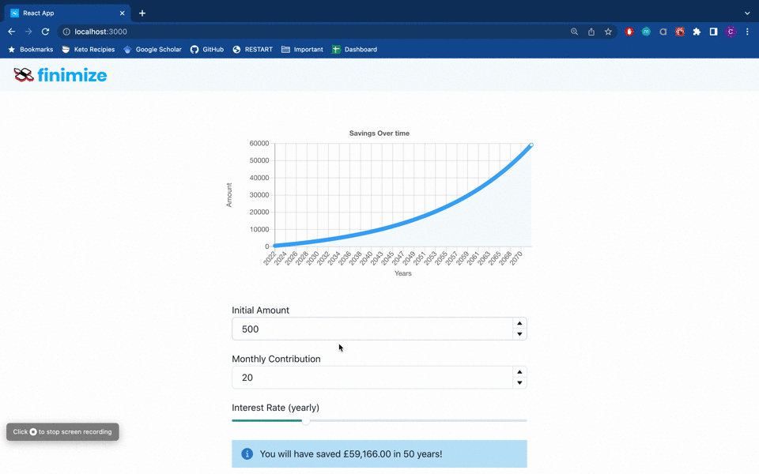

# Finimize dev challenge

## Solution
This app will show the amount saved over the course of 50 years, changing the following parameters:
- Initial amount
- Monthly depoist
- Yearly interest rate

## Working Solution


### Further work
#### Multiple API calls (Slider)
Fixing the multiple API calls on the slider `onChange`. I used `onChangeEnd` initially as documented in the Chakra UI docs but unfortunately this caused issues with state updates, whereby the state was reset to the initial placeholder values when the slider was updated. Tried the following but didn't work:

```
onChange={useCallback((e) => {
                onChange(e)
                setSliderValue(e)
            },[])}
```
#### Testing
As I have no experience with React I know that this solution lacks robust testing. I would love to discuss testing strategy in React further!

## Python & Django setup

* Install `python3` via brew
* Clone the repo
* cd into repo
* Install `virtualenv` using `pip3` (think yarn)

```sh
sudo pip3 install virtualenv
```

* Create a virtualenv for the project

```sh
virtualenv -p python3 venv
```

If you're having trouble completing this step, try upgrading virtualenv first `pip3 install --upgrade virtualenv`

* Activate the virtualenv

```sh
source venv/bin/activate
```

* Install dependencies in the new virtualenv

```
pip3 install -r requirements.txt
```

```
python3 manage.py runserver
```

* Server should be running at http://localhost:8000


 ## Client setup

 * cd into `frontend` and run `yarn install`

 * Run `yarn start`. 

The webapp should now be running at http://localhost:3000 🚀


## The challenge

Create a web-app that shows how much you can expect to make from your savings over time.

The app must satisfy the following Acceptance Criteria (ACs):

* It should allow the user to vary the initial savings amount, monthly deposit and interest rate through the UI
* It should display how much the user's initial savings amount will be worth over the next 50 years. This should assume that the monthly amount is paid in each month, and the value rises with the interest rate supplied. There are resources online about calculating compound interest totals - e.g. [Wikipedia](https://en.wikipedia.org/wiki/Compound_interest#Investing:_monthly_deposits)
* All calculations must take place server-side, and all monthly projection data should be returned via an endpoint
* The calculations must be triggered onChange of any input, to give live feedback on the input data. The performance (try the slider) should be reasonable.

### Our Guidance

The challenge should not take any more than 2-3 hours. You do not need to complete the challenge in one go.

These are some qualities we value:
 * Well-modularised, robust and clearly-written code
 * Maintainability. Another team member should be able to easily work with your code after you've finished.
 * Single Responsibility Principle
 * A well-organised codebase

An outline UI has been provided, as well as some simple setup logic on the server. How you connect these and structure logic is up to you! Feel free to make changes to any of the code provided (including the UI) if you wish.

We have chosen to include a basic design system on the client, to give you an idea of how we like to build UIs. For this challenge we have used [Chakra JS](https://chakra-ui.com/docs/getting-started). If you're not familiar with such systems, hopefully this won't be too steep a learning curve. The docs will give you details of all the components/props you can use, but as a head-start, you can pass in styling props to the components including margins/padding etc like this:

```
// This produces a Box (styled div) with a top margin of 2, padding of 3 and a black background colour.
// Colours and spacing properties are defined in `themes/index.tsx`
<Box mt={2} p={3} bg='black'>
```

Although the API might be relatively straightforward, please try and write the API code as if you were building something more complex. We would like to gain an idea of how you would go about structuring API code.

**Once complete**, drop us a brief note (either an email, or in the readme somewhere) explaining:
* How you approached the challenge
* What bits of your solution you like
* What bits of your solution you’d like to improve upon

Plese also attach an image/gif of the finished product.

### Tooling

The frontend contains some tooling you might be familiar with

#### Typescript

If you like to use Typescript in your workflow, you should get any warnings/errors appear in your terminal after running `yarn start`.

We believe strong TS typing will make your code much more robust.

#### Prettier

We believe Prettier makes your life easier! There is an example .prettierrc included in the `frontend` directory - feel free to tweak the settings if you'd prefer.

You might need to give your IDE a nudge to pick the settings up - [here's an example](https://stackoverflow.com/a/58669550/4388938) of how to do that with VS Code
